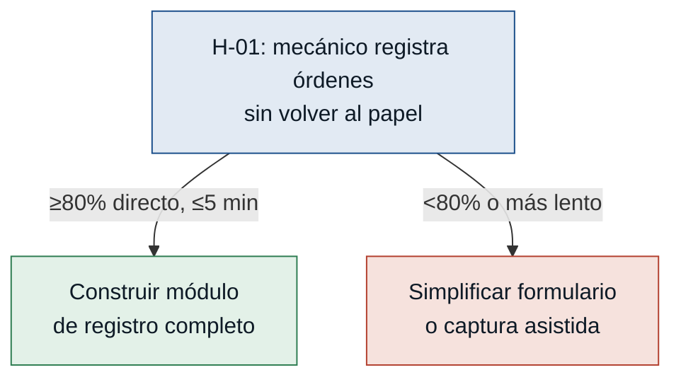

# Hipótesis y Experimentos — Gestión Vehicular Policial

Supuestos riesgosos extraídos del MVP Canvas (`mvp-canvas.md`, sección "Riesgos /
supuestos" y árbol S-1…S-4), convertidos en hipótesis falsables. Ordenadas de
mayor a menor riesgo (impacto de equivocarse × incertidumbre).

> Nota de priorización: en el árbol del MVP Canvas, S-1 (policía) y S-2
> (mecánico) están ambos marcados como ALTO. Aquí se prueba primero el supuesto
> del **mecánico** (H-01): si el mecánico no registra en el sistema, no hay
> datos para historial, costos ni reportes — es un cuello de botella que bloquea
> toda la cadena de valor, no solo la métrica de éxito. El supuesto del
> **policía** (H-02) amenaza directamente la métrica de éxito del MVP, pero el
> encargado puede seguir agendando en su nombre como respaldo parcial; por eso
> queda en segundo lugar.

---

### [H-01] El mecánico registrará las órdenes sin volver al papel — riesgo: alto
- **Supuesto a probar:** el mecánico (sin estudios superiores, muchos años en el
  proceso manual) podrá y querrá registrar órdenes de trabajo completas en la
  interfaz digital, sin volver al papel para transcribir después.
- **Hipótesis:** Creemos que el mecánico registrará las órdenes de trabajo
  completas en el sistema si el formulario de registro toma el mismo tiempo o
  menos que anotar en papel y subir a Excel, porque su queja en la entrevista no
  es resistencia al cambio sino el tiempo perdido cuadrando el Excel a fin de
  mes y olvidando anotar datos (`mecanico.md`).
- **Señal medible:** porcentaje de órdenes de trabajo del piloto registradas
  directamente en el sistema por el mecánico (sin quedarse en papel para
  transcribir luego) y tiempo promedio de registro por orden.
- **Criterio de éxito:** ≥ 80 % de las órdenes de un piloto de 2 semanas en un
  centro, registradas directamente por el mecánico sin ayuda externa, con
  tiempo promedio ≤ 5 minutos por orden.
- **Experimento:** Mago de Oz / prototipo funcional mínimo — formulario de
  registro de orden de trabajo (vehículo, trabajos, materiales, costos) probado
  con el mecánico en 10-15 órdenes reales, con acompañamiento el primer día y
  sin ayuda el resto de la semana.
- **Caja de tiempo/costo:** 1 semana, 1 mecánico, 1 centro; solo el formulario
  de registro (no el resto del sistema).
- **Regla de decisión:** Si pasa → construir el módulo completo de registro de
  órdenes tal como está diseñado. Si falla → simplificar el formulario (menos
  campos obligatorios, entrada por foto o dictado) o mantener una captura
  asistida por el encargado como paso intermedio, y volver a probar antes de
  escalar a más centros.

---

### [H-02] Los policías asistirán a su mantenimiento con recordatorio digital — riesgo: alto
- **Supuesto a probar:** los policías adoptarán el autoagendamiento y los
  recordatorios digitales en lugar de ignorarlos, como ignoraban el papel con
  la fecha del próximo mantenimiento.
- **Hipótesis:** Creemos que los policías asistirán a su mantenimiento
  programado si reciben un recordatorio automático 48 horas antes por un canal
  que ya revisan (WhatsApp/SMS) con opción de confirmar o reagendar, porque
  según la entrevista el problema no es falta de voluntad sino el olvido: "si se
  pone un papel con el próximo mantenimiento siempre se pierde o se nos olvida"
  (`policia.md`).
- **Señal medible:** tasa de asistencia a mantenimientos programados entre los
  policías que recibieron el recordatorio digital, sin llamada de reclamo del
  mecánico.
- **Criterio de éxito:** ≥ 70 % de asistencia sin llamada de reclamo, en un
  piloto de 3 semanas en un centro (mismo umbral que la métrica de éxito del
  MVP Canvas).
- **Experimento:** Fake door / concierge — enviar recordatorios reales por
  WhatsApp/SMS 48 horas antes a los policías con turnos ya agendados por el
  encargado (sin construir aún el autoagendamiento), y registrar manualmente
  cuántos asisten sin llamada de seguimiento del mecánico.
- **Caja de tiempo/costo:** 3 semanas, 1 centro; solo el envío de recordatorios
  y el registro manual de asistencia (no el módulo de autoagendamiento).
- **Regla de decisión:** Si pasa → construir el módulo de recordatorios y
  autoagendamiento tal como está diseñado. Si falla → entrevistar a los
  policías que no asistieron para identificar la causa (canal equivocado,
  mensaje poco claro, falta de confirmación) y probar un segundo canal o exigir
  confirmación explícita antes de invertir en el autoagendamiento completo.

---

### [H-03] El encargado migrará el agendamiento del celular al sistema — riesgo: medio
- **Supuesto a probar:** el encargado dejará de coordinar turnos por su celular
  personal y usará el sistema como canal principal de agendamiento.
- **Hipótesis:** Creemos que el encargado migrará el agendamiento a la agenda
  digital si esta le ahorra las llamadas que hoy olvida hacer al mecánico,
  porque su queja en la entrevista es que se le olvida avisar, no que prefiera
  el celular: "a veces me llaman al celular personal para agendar y me olvido o
  no tengo tiempo de avisar al mecánico" (`encargado.md`).
- **Señal medible:** porcentaje de turnos coordinados en la semana que el
  encargado ingresa en la agenda digital el mismo día de la coordinación.
- **Criterio de éxito:** ≥ 85 % de los turnos coordinados en un piloto de 2
  semanas quedan registrados en el sistema el mismo día de la coordinación.
- **Experimento:** Prototipo desechable / smoke test — dar al encargado acceso
  a una agenda digital mínima (crear/editar turno) durante 2 semanas y comparar
  contra su registro habitual en el celular personal.
- **Caja de tiempo/costo:** 2 semanas, 1 encargado, 1 centro; solo el módulo de
  creación/edición de turnos.
- **Regla de decisión:** Si pasa → construir el flujo completo de agenda para
  el encargado. Si falla → identificar la fricción puntual (acceso desde el
  celular, velocidad de carga) y simplificar la entrada (plantilla rápida o
  carga por voz) antes de escalar a más centros.

---

### [H-04] El gerente preferirá el panel de aprobaciones al correo — riesgo: bajo
- **Supuesto a probar:** el gerente usará el panel móvil de aprobaciones en
  lugar de seguir esperando su correo diario de Excel.
- **Hipótesis:** Creemos que el gerente aprobará solicitudes de repuestos desde
  el panel móvil si esto le toma menos pasos que abrir el correo desde el
  celular, porque su queja en la entrevista es que el Excel no le abre bien en
  el celular y le llegan demasiados correos sueltos, no que rechace un canal
  digital (`gerente.md`).
- **Señal medible:** porcentaje de solicitudes de repuestos que el gerente
  aprueba o rechaza desde el panel dentro de las primeras 24 horas de llegada.
- **Criterio de éxito:** ≥ 75 % de las solicitudes de un piloto de 1 mes,
  aprobadas o rechazadas desde el panel dentro de las primeras 24 horas (frente
  a la demora de días reportada actualmente por el encargado).
- **Experimento:** Prototipo evolutivo mínimo — habilitar solo la bandeja de
  aprobación de solicitudes de repuestos en el panel móvil (sin el resto de
  bandejas) durante 1 mes con solicitudes reales de un centro.
- **Caja de tiempo/costo:** 1 mes, 1 gerente, 1 centro; solo la bandeja de
  aprobación de repuestos.
- **Regla de decisión:** Si pasa → construir el panel gerencial completo con
  las demás bandejas (viajes, novedades, reportes). Si falla → indagar con el
  gerente qué información le falta para decidir sin llamar al encargado, y
  ajustar el flujo de aprobación antes de construir el resto del panel.

---

## Árbol de decisión del experimento prioritario

