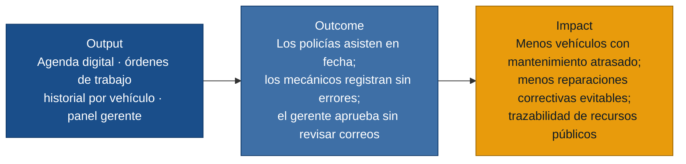
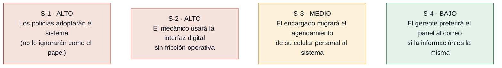

# MVP Canvas — Sistema de Gestión de Mantenimientos Vehiculares Policiales

## Cadena de valor

---

## Canvas

| Bloque | Contenido |
|---|---|
| **Propuesta de valor** | Reemplazar el ciclo de Excel, papel y correos por un sistema digital que garantice que los mantenimientos programados se cumplan, que el mecánico cuente con el historial del vehículo antes de cada intervención, y que el gerente vea el estado de sus centros y apruebe solicitudes sin llamar a nadie ni abrir su bandeja de correo. |
| **Segmento de usuarios** | Mecánico (registra y consulta); Encargado (programa, coordina, solicita repuestos); Policía (agenda, recibe recordatorios, consulta historial); Gerente (supervisa, aprueba desde móvil). |
| **Funcionalidades mínimas** | 1. Agenda digital de mantenimientos (programación por encargado, autoagendamiento por policía, vistas diaria/semanal/mensual para mecánico y encargado). · 2. Cancelación y reagendamiento digital de turnos por el policía. · 3. Recordatorio automático al policía 48 horas antes del mantenimiento. · 4. Registro digital de órdenes de trabajo (vehículo, trabajos, materiales, costos con cálculo automático). · 5. Historial de mantenimientos por vehículo, consultable por mecánico y policía. · 6. Flujo digital de solicitud y aprobación de repuestos (encargado → gerente → notificación de resultado). · 7. Panel del gerente mobile-friendly con estado de mantenimientos y bandeja de aprobaciones. |
| **Resultado esperado (outcome)** | Los policías asisten a sus mantenimientos sin que el mecánico tenga que llamarlos a reclamar. El mecánico cierra cada orden en el sistema sin riesgo de olvido o error de suma. El gerente revisa y aprueba solicitudes de repuestos desde el panel, sin correos intermedios ni llamadas de seguimiento del encargado. |
| **Métrica de éxito** | **Tasa de cumplimiento de mantenimientos programados:** porcentaje de turnos programados que se completan en la fecha acordada (sin rescheduling ni no asistencia), medido sobre el primer mes de uso en al menos un centro piloto. Meta: ≥ 70 %. Prueba ácida: si la tasa sube, el encargado puede reducir las llamadas de seguimiento y el gerente puede identificar qué centros tienen problemas de cumplimiento y tomar decisiones de asignación de recursos. |
| **Riesgos / supuestos** | 1. Los policías adoptarán el autoagendamiento digital en lugar de ignorarlo (igual que ignoraban el papel con la fecha del próximo mantenimiento). · 2. El encargado migrará el agendamiento de su celular personal al sistema sin resistencia operativa. · 3. El mecánico, sin estudios superiores y con muchos años en el proceso manual, podrá registrar órdenes en la interfaz digital sin capacitación extensa. · 4. El gerente usará el panel en lugar de esperar su correo diario de Excel. |
| **Fuera de alcance (por ahora)** | **Inventario de bodega (R-07, R-08):** requiere levantamiento inicial del stock físico y proceso de cuadre; la complejidad de datos de entrada es alta para un MVP. Entra en iteración 2 una vez estabilizado el registro de órdenes de trabajo. · **Autorización digital de viajes (R-11):** proceso menos frecuente; la ganancia no justifica el costo en el MVP. · **Traspasos digitales con fotos (R-12):** requiere gestión de archivos pesados; bajo volumen relativo. · **Registro de novedades con fotos/videos (R-13):** ídem; requiere almacenamiento de medios. · **Reportes avanzados automáticos (R-14):** se habilitan en iteración 2 cuando el registro de órdenes tenga suficiente data histórica. · **Historial de traspasos y viajes en una sola pantalla (R-16):** depende de R-11 y R-12, que están fuera de alcance. |

---

## Árbol de riesgos / supuestos (referencia para `/discovery:experiments`)

