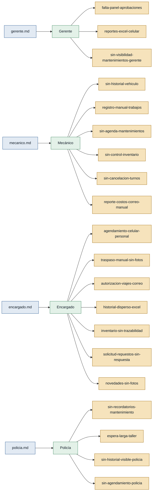

# Personas y Stakeholders — Gestión Vehicular Policial

## Mapa de trazabilidad

> Verde = primera mano · Ámbar = referenciada (no aplica en este discovery: todos son primera mano)

---

## Personas

### Gerente — gerente de centros vehiculares policiales

- **Contexto:** Responsable de supervisar entre 1 y 4 centros de gestión vehicular de la policía en una misma ciudad. No opera in situ; trabaja desde su despacho aprobando solicitudes y revisando reportes.
- **Objetivo principal:** Aprobar repuestos y viajes de manera ágil y tener visibilidad del estado de los mantenimientos y del parque vehicular sin depender de consultas directas a mecánicos ni de correos en Excel.
- **Dolores:**
  - No tiene un panel centralizado para ver el estado de mantenimientos pendientes, órdenes de repuestos y viajes por aprobar; todo llega por correo electrónico. `(gerente.md)`
  - Los reportes llegan casi a diario en Excel y no se visualizan correctamente en dispositivos móviles; solo los necesita a fin de mes. `(gerente.md)`
  - Para conocer el estado de los vehículos o los mantenimientos pendientes debe consultar directamente a mecánicos o encargados, sin posibilidad de consulta autónoma. `(gerente.md)`
- **Respaldo:** `primera mano`

---

### Mecánico — mecánico de planta del centro vehicular

- **Contexto:** Profesional de planta que ejecuta mantenimientos preventivos y correctivos de los vehículos policiales. Lleva el registro de trabajos realizados, materiales consumidos y costos asociados.
- **Objetivo principal:** Registrar eficientemente los trabajos y costos, conocer el historial del vehículo antes de cada intervención y gestionar el inventario de repuestos sin depender de búsquedas físicas en bodega.
- **Dolores:**
  - Anota los datos del vehículo (motor, chasis, kilometraje) de forma manual porque no existe historial digital por vehículo; el kilometraje del mantenimiento anterior es difícil de rastrear. `(mecanico.md)`
  - El registro de materiales y costos se lleva en Excel; existe riesgo de olvido y ha habido errores de suma con consecuencias para la institución. `(mecanico.md)`
  - No existe inventario digital de repuestos y consumibles; la verificación se hace físicamente en bodega y a veces no hay lo necesario cuando se necesita. `(mecanico.md)`
  - No hay sistema de programación de mantenimientos; el listado en Excel casi nunca se cumple y no hay visibilidad diaria/semanal/mensual. `(mecanico.md)`
  - Los policías no pueden cancelar un turno de forma digital; solo llaman por teléfono y muchas veces simplemente no aparecen sin previo aviso. `(mecanico.md)`
  - El reporte de costos se genera en formato impreso y se envía por correo cada día y a fin de mes; es un proceso completamente manual. `(mecanico.md)`
- **Respaldo:** `primera mano`

---

### Encargado — encargado del centro de gestión vehicular

- **Contexto:** Coordina la logística operativa del centro: supervisa a los mecánicos, gestiona el agendamiento de vehículos, los traspasos entre policías, el registro de novedades, la autorización de viajes y el inventario de repuestos.
- **Objetivo principal:** Controlar y documentar todas las operaciones del centro desde un sistema unificado, sin depender de múltiples hojas de Excel, llamadas al celular personal y formatos impresos.
- **Dolores:**
  - No existe sistema de agendamiento; recibe solicitudes en su celular personal y con frecuencia no puede avisar al mecánico a tiempo. `(encargado.md)`
  - El traspaso de vehículos entre policías se registra en papel y luego se pasa manualmente a Excel; no existe forma de adjuntar las fotos de la inspección de entrega. `(encargado.md)`
  - Las solicitudes de autorización de viajes se tramitan por correo; el gerente a veces no los ve y hay que llamar para confirmar la aprobación. `(encargado.md)`
  - El historial de traspasos, viajes y novedades está disperso en múltiples hojas de Excel y es fácil pasar cosas por alto al buscar. `(encargado.md)`
  - El inventario de repuestos en Excel no es confiable; no se puede rastrear quién usó un repuesto ni en qué vehículo; el cuadre mensual casi siempre arroja diferencias. `(encargado.md)`
  - Las solicitudes de repuestos al gerente se envían por correo y no siempre llega una respuesta formal de aprobación o rechazo, obligando a llamar para confirmar. `(encargado.md)`
  - El registro de novedades (accidentes, rayones, ataques) requiere adjuntar fotos o videos pero no existe sistema donde subirlos; todo se notifica por correo. `(encargado.md)`
- **Respaldo:** `primera mano`

---

### Policía — policía con vehículo institucional asignado

- **Contexto:** Efectivo policial responsable de un vehículo institucional. Debe llevar el vehículo al mantenimiento periódico y reportar averías; recibe o entrega el vehículo cuando cambia de funciones.
- **Objetivo principal:** Cumplir con los mantenimientos a tiempo sin perder jornadas laborales y poder conocer el historial del vehículo que se le asigna.
- **Dolores:**
  - No recibe recordatorios de mantenimientos próximos; olvida la fecha o se entera cuando el mecánico llama a reclamar. `(policia.md)`
  - No puede agendar una cita digital para mantenimiento; depende de llamar al mecánico si tiene su número. `(policia.md)`
  - Pierde medio día o más esperando en el taller porque no hay sistema de turnos que permita ir a una hora acordada. `(policia.md)`
  - Al recibir un vehículo asignado no puede consultar su historial de mantenimientos ni si tiene problemas recurrentes. `(policia.md)`
- **Respaldo:** `primera mano`

---

## Stakeholders

### Institución Policial (nivel directivo / autoridad institucional)

- **Interés en el sistema:** Garantizar el correcto mantenimiento del parque vehicular, la trazabilidad del uso de recursos públicos (repuestos, consumibles) y el cumplimiento de los procesos de autorización y control establecidos.
- **Fuente:** Inferido de los procesos de aprobación y control descritos en `gerente.md`, `encargado.md` y `policia.md`. No existe entrevista directa de este actor.

### Departamento administrativo / contable

- **Interés en el sistema:** Recibir reportes consolidados, verificables y sin errores de suma sobre costos de mantenimiento y consumo de repuestos.
- **Fuente:** Inferido del proceso de reporte descrito en `mecanico.md` ("se manda manualmente un correo al gerente con los costos del día; al final del mes se escanea y manda el consolidado"). No existe entrevista directa.
